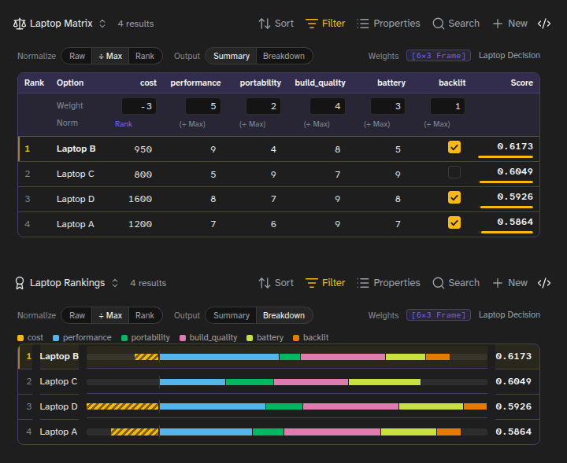

# Decision Matrix Bases View

A weighted decision matrix for [Obsidian Bases](https://help.obsidian.md/bases). Each note in a base is an option you are choosing between. You score the options against your criteria, say how much each criterion matters, and the view ranks them, with the working shown.

The scores and weights live in [Solenoid Properties](https://github.com/bubba8587/Solenoid-Properties) Frames, small typed tables inside a note's properties, and the view scores them by the same rules as [Solenoid](https://solenoid-ngc.vercel.app)'s Decision Matrix node.



## What 1.0 changes

1.0 is a rewrite. Each note keeps all its scores in one `scores` Frame instead of a property per criterion, so the properties panel stays tidy. The weights live in one `weights` Frame on your decision note instead of a `weight_` property per criterion. Scoring follows Solenoid's rules, and the whole view wears Solenoid's design.

Coming from 0.7? Open your decision and choose **Convert to frames**. It moves everything across in one step, described under [Upgrading from 0.7](#upgrading-from-07).

## Requirements

- Obsidian **1.10.2** or later, on desktop or mobile.
- The **Solenoid Properties** plugin, installed and enabled. It provides the Frame property type and the editor for it. The view is designed for its Solenoid look, so turn that on in its settings.

## Getting started

The quickest start is **Settings → Decision Matrix → Create examples**. It adds a folder with four laptops, a base with both views, and a decision note that embeds them. Open **Laptop Decision** and try changing a weight.

To set up your own:

1. Put the options in a folder, one note each.
2. Create a base over that folder and add a **Decision Matrix** view, a **Decision Matrix Rankings** view, or both.
3. Embed the base in a note that describes the decision (`![[my-decision.base]]`). That note is the decision note, and it holds the weights.
4. In the view, choose **Add criterion** and name one, then type each option's score into its column. Repeat for each criterion.

The view writes the Frames for you as you go, so you never have to type YAML.

## How a decision is stored

**Scores.** Each option note has a `scores` Frame with one row and a column per criterion:

```yaml
scores:
  - cost: 950
    performance: 9
    backlit: true
```

Number and checkbox columns are criteria. Text and date columns are ignored, so a note can keep a vendor or a release date beside its scores. The criteria are every such column across the notes in the base.

**Weights.** The decision note has a `weights` Frame with a row per criterion:

```yaml
weights:
  - Criterion: cost
    Weight: -3
    Norm: Rank
  - Criterion: performance
    Weight: 5
    Norm: null
```

- **Criterion** names a scores column, ignoring case.
- **Weight** says how much it counts. A negative weight means lower is better, for things like price or risk. A criterion without a row weighs 1.
- **Norm** optionally overrides how that criterion is normalized: Raw, ÷Max or Rank. Blank follows the view.

These are the same two tables Solenoid's Decision Matrix node takes, so a decision imports into Solenoid as it is.

**Column types.** A column's type is the one set in Solenoid Properties' Frame editor, which records it every time a Frame is saved. The view records the types of the columns it creates too. In a number column, a value that is not a number (like `n/a`) is ignored: it scores like a blank and shows struck through, so you can see it was not counted.

## The two views

**Decision Matrix** is a table with an option per row and a criterion per column. Under each criterion's name sit its Weight, its Norm and its flip point. The Rank, Option and Score columns stay put while a wide table scrolls.

**Decision Matrix Rankings** shows every option best first as a bar. Under Breakdown, each bar splits into each criterion's contribution, and penalties are hatched to the left of zero.

Both views have two controls, saved with the view:

- **Normalize** puts criteria on one footing, so dollars and out-of-10 ratings compare. **÷ Max** (the default) divides each criterion by its largest value. **Rank** keeps only the order, worst 0 to best 1. **Raw** uses the numbers as they are.
- **Output** is **Summary** or **Breakdown**. Breakdown shows each criterion's signed contribution, and the contributions add up to the Score.

## Working in the matrix

- Click a value to edit it. **Enter** saves and moves down the column, and **↑** and **↓** move up and down, like a spreadsheet. The rows keep still while you type and take their new ranks when you leave the table.
- A blank cell is dashed and shows, in italics, the value it is scored as.
- In a weight, **↑** and **↓** step it by 1, or by 0.1 with **Shift**.
- **Add criterion** under the table adds a new criterion. It starts counting once an option has a value for it.
- Click a criterion's name for **Rename**, **Lower is better** and **Remove criterion**. Rename and Remove change every note's scores Frame and the weights row.
- Click an option to open its note, **Ctrl**-hover for a preview, or right-click for the file menu.
- The chip beside **Weights** opens the weights Frame in Solenoid Properties' editor. If there is no weights Frame yet, **Create weights** adds one with every criterion at 1.
- The **⋯** menu has **Copy as Markdown**, which copies the ranking as a table (with the contributions under Breakdown), **Write result to properties** and **Reset weights**.

## Writing the result to properties

**Write result to properties** in the **⋯** menu saves the ranking as a `result` Frame on the decision note, so other notes, queries and Solenoid can read it. It is the table Solenoid's Decision Matrix node outputs, best first:

```yaml
result:
  - Option: Laptop B
    Score: 0.6173
    Rank: 1
  - Option: Laptop C
    Score: 0.6049
    Rank: 2
```

Under Breakdown, each criterion's signed contribution gets a column between Option and Score. The Frame is a snapshot: it is rewritten each time you choose the command, not kept in step as scores change. Its column types are recorded (Option text, the rest numbers), and a criterion named like another column gets a number on the end (`Score2`), as in Solenoid.

## How scores are worked out

- Score = `Σ(value × weight) / Σ|weight|`, rounded to 4 decimal places.
- Options rank on the rounded score. Equal scores share a rank, shown as `=2`.
- A checkbox counts as 1 when ticked and 0 when not.
- **A blank scores as that criterion's median** across the options, so an option you have not scored yet is neither rewarded nor penalized. Without this, a blank cost would count as 0 and make the option look like the cheapest. The median is shown dimmed in the cell and never written to the note. Solenoid's node still scores a blank as 0, and this is the one place the two differ.

## How close is the call?

The line above each view names the leader, the runner-up and the margin between them, or says who is tied.

Under each weight, **Flips at** is the weight at which a different option would take first place if every other weight stayed where it is. A flip point close to the current weight means the decision hangs on that weight. **never** means no weight on that criterion changes the winner.

## View options

Each view has these options in the Bases view settings, alongside Normalize and Output:

- **Scores property** and **Weights property** use property names other than `scores` and `weights`.
- **Result property** names the property **Write result to properties** writes, `result` by default.
- **Weights note** reads the weights from a chosen note instead of the one the base is embedded in.

## Upgrading from 0.7

0.7 kept each score in its own note property and each weight in a `weight_<criterion>` property on the decision note. Open the decision note and the view offers **Convert to frames** (it is also in the **⋯** menu while there is anything to convert).

Conversion finds the criteria the way 0.7 did: the numeric properties in the view's column order, or every numeric property when the view lists none. It moves each note's values into its scores Frame and the `weight_` properties into the weights Frame, records their column types, and removes the old properties. A confirmation names exactly what will move first. If you had set 0.7's score prefix, it comes off the column names, the way 0.7 showed them.

0.7's scale setting, Rank Raws, Normalize button and folded columns are gone. Rank normalizing replaces Rank Raws, and the ÷ Max default replaces the scale.

## On a phone

The view works on mobile. A narrow table keeps Rank, Option and Score in place and scrolls the criteria between them, and the Rankings view puts each bar under its option's name. In a very narrow pane, such as a three-way split, the whole table scrolls instead.

## Development

- `npm run build` builds `main.js`.
- `npm test` runs the scoring, Frame and conversion tests.
- `npm run lint` runs Obsidian's plugin-review rules (`eslint-plugin-obsidianmd`).
- `SOLENOID=../solenoid npm run parity` checks the scoring against Solenoid's own engine. It bundles Solenoid's Decision Matrix and Frame typing from a Solenoid checkout and compares criteria, scores, ranks and contributions on thousands of random decisions with stray values, column types, odd weights and Norm spellings. Blanks are filled with medians on Solenoid's side first, so it checks everything except that one rule. It exits non-zero on any disagreement.
- `SP=<a Solenoid Properties build folder> npm run e2e` runs the plugin in a private Obsidian (Linux with Xvfb; `OBSIDIAN` points at the binary). It makes 42 feature checks, from rendering and editing to criterion edits, view options, writing the result, two views at once and Solenoid Properties switched off, then converts 0.7's own example. It exits non-zero on any failure or console error. Run it against a Solenoid Properties build with its plugin API and against 0.1.5, which has none, since the view supports both.

The view uses Solenoid Properties' plugin API (version 1) to show its Frame chip and editor and to read and record column types. It falls back to the methods older releases have.

## License

MIT
